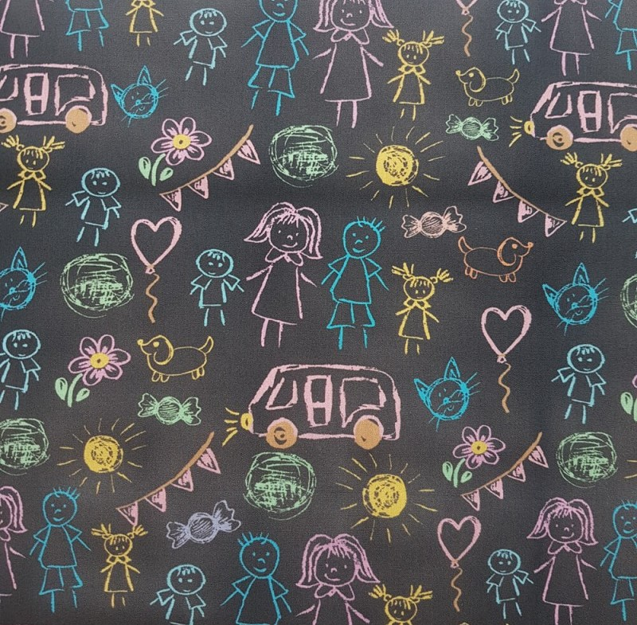

# SketchFlow

---

### Descripción

SketchFlow es una aplicación web sencilla para anotaciones gráficas. Permite a los usuarios dibujar, agregar texto y exportar sus creaciones. La aplicación está construida con HTML, CSS y JavaScript.

### Cómo Usar

1. Abre el archivo `index.html` en tu navegador web preferido.
2. Utiliza las herramientas de dibujo para crear tus anotaciones gráficas.
3. Activa la herramienta de texto para agregar anotaciones de texto.
4. Ajusta el color y grosor de tus trazos utilizando los controles proporcionados.
5. Exporta tu diseño como una imagen JPEG o PNG.

### Funcionalidades

- Herramientas de dibujo para anotaciones a mano alzada.
- Herramienta de texto para agregar anotaciones textuales.
- Selector de color y control deslizante de grosor para personalización.
- Exportación de diseños como imágenes JPEG o PNG.

### Cómo Contribuir

Si deseas contribuir al desarrollo de SketchFlow, sigue estos pasos:

1. Haz un fork del repositorio.
2. Clona tu fork: `git clone https://github.com/TU_USUARIO/sketchflow-app.git`
3. Crea una rama para tus cambios: `git checkout -b tu-rama`
4. Realiza tus modificaciones y haz commit: `git commit -m "Añadir nuevas funcionalidades"`
5. Sube tus cambios: `git push origin tu-rama`
6. Abre un Pull Request en GitHub.

¡Se agradecen tus contribuciones! Además, sígueme en mis redes sociales para apoyar este proyecto y otros a través de este enlace: [https://linktr.ee/mario.conf](https://linktr.ee/mario.conf).

---

# SketchFlow

---

### Description

SketchFlow is a simple web application for graphic annotations. It allows users to draw, add text, and export their creations. The application is built using HTML, CSS, and JavaScript.

### How to Use

1. Open the `index.html` file in your preferred web browser.
2. Use the drawing tools to create your graphic annotations.
3. Toggle the text tool to add text annotations.
4. Adjust the color and thickness of your strokes using the provided controls.
5. Export your design as a JPEG or PNG image.

### Features

- Drawing tools for freehand annotations.
- Text tool for adding textual annotations.
- Color picker and thickness slider for customization.
- Export designs as JPEG or PNG images.

### How to Contribute

If you want to contribute to the development of SketchFlow, follow these steps:

1. Fork the repository.
2. Clone your fork: `git clone https://github.com/YOUR_USERNAME/sketchflow-app.git`
3. Create a branch for your changes: `git checkout -b your-branch`
4. Make your modifications and commit: `git commit -m "Add new features"`
5. Push your changes: `git push origin your-branch`
6. Open a Pull Request on GitHub.

Your contributions are appreciated! Feel free to follow me on my social media to support this project and others through this link: [https://linktr.ee/mario.conf](https://linktr.ee/mario.conf).
